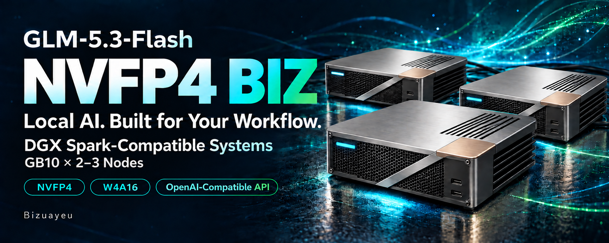

# GLM-5.3-Flash-NVFP4-DGX-Sparks-BIZ

[日本語](README.ja.md)

**NVFP4 BIZ** serves NVIDIA's pinned GLM-5.3-Flash NVFP4 checkpoint as distributed, on DGX Spark or compatible GB10 systems. This repository carries one directory per serving line:

| Line | Engine | Directory | Changelog |
|---|---|---|---|
| 1.x | vLLM | [v1/](v1/README.md) | [v1/CHANGELOG.md](v1/CHANGELOG.md) |
| 2.x | TensorFold | [v2/](v2/README.md): TP=2 and TP=3, FP8 KV, text, tool calls and images ([setup](v2/SETUP.md)) | [v2/CHANGELOG.md](v2/CHANGELOG.md) |

Each line has its own README, version and changelog; a release tag `v1.*` or `v2.*` publishes the section of that line's changelog. Each line holds what is specific to its engine: 1.x's commands run from `v1/`, 2.x's tools from `v2/` and its image build and scripts from the checkout root ([setup](v2/SETUP.md)). The checkout root holds what every line shares: the host and fabric pages and the repository's document map in [`docs/`](docs/README.md), the host tools in [`host/`](host/README.md), licensing, and in `tools/` the repository's publication audit and release notes. `state/` and `records/` are untracked and stay at the checkout root.

## BIZ

**BIZ** is the maintainer's mark (Bizuayeu) and states the intent: a business-use setup with commercially usable licensing, pinned assets, recorded checks and reversible operation.

BIZ is an intent, not a promise. It is not a product tier, a support commitment, a warranty or a certification. Business-use readiness is an acceptance outcome for the scope each line declares, not implied by the suffix. Each line's README states its own limits in its disclaimer.

## Licensing at a glance

Each artifact keeps its own terms; obligations and the rationale are in the [licensing guide](docs/licensing.md), provenance in the [third-party notices](THIRD_PARTY_NOTICES.md).

| Artifact | License | Where it comes from |
|---|---|---|
| Original setup code and documents | **Apache-2.0** | This repository |
| GLM-5.3-Flash NVFP4 weights | **MIT** (stated in the pinned NVIDIA model card; upstream Z.ai model is MIT) | Downloaded by the operator; not bundled |
| Attention and `lm_head` W4A16 repack (1.x's published option) | **MIT**, with NVIDIA's model card beside it | Optional [Hugging Face weights](docs/licensing.md#weight-notices); outside Git |
| LPA cut32 auxiliary projector (1.x) | **Apache-2.0**; training-data notices retained separately | Optional [Release asset](v1/docs/lpa.md#download-the-trained-projector); outside Git |
| TensorFold, the BIZ release (2.x) | **Apache-2.0** (code from before 0.6.0 keeps its MIT notice) | Cloned into the image from [Bizuayeu/TensorFold](https://github.com/Bizuayeu/TensorFold) at `TENSORFOLD_REF`, with the engine's own notices under `/opt/tensorfold`; not vendored here |
| Built container image | Per bundled component (CUDA, Torch, NCCL and others; NVIDIA's PyTorch container under NVIDIA's terms); not treated as one blanket license | Built by the operator from the pinned official base image |
| ZCode / Claude Code harnesses (1.x) | Each product's own terms | Installed separately; nothing is relicensed here |

Distributing this repository as source, pinned references and build steps requires Apache-2.0 compliance plus retention of the copyright and license notices of the adapted third-party code (MIT and Apache). Redistributing weights or built images adds those artifacts' conditions. The serving paths have no non-commercial or no-derivatives terms in them: 1.x does not require EXL3/TR3 weights, DFlash2 weights or Mia's current AGPL distribution, and 2.x does not load the DFlash2 draft weights (CC BY-NC-ND 4.0; `--drafter none`) or use EXL3 or other requantized weights. See [commercial use, modification and redistribution](docs/licensing.md) for permissions and obligations by artifact.

## Local data and contribution

`state/`, `records/`, credentials, site-specific configuration (2.x's rank and cluster files with your site's values included) and weights are excluded from Git and the Docker build context. Publish reviewed summaries, not raw local logs.

Licensing: [LICENSE](LICENSE) (Apache-2.0), [NOTICE](NOTICE) and [third-party notices](THIRD_PARTY_NOTICES.md). Contributions: [CONTRIBUTING.md](CONTRIBUTING.md), which describes the CPU checks and the publication audit.
