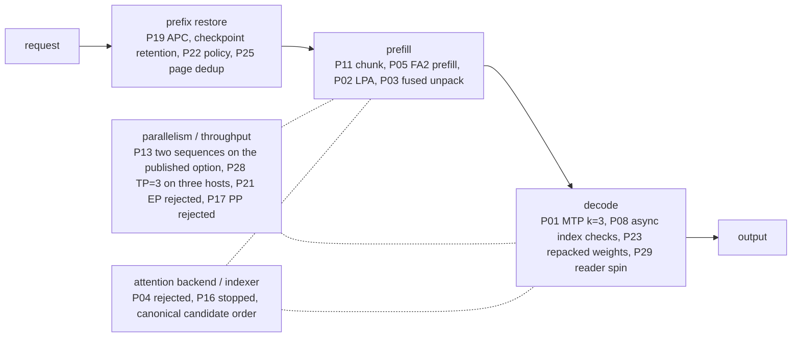

# Inference optimization overview

[日本語](optimization-overview.ja.md) · [Catalog](optimization-catalog.md) · [Document map](README.md)

One page showing which measure acts on which inference stage, where each one stands, and which profile fits which workload. The [catalog](optimization-catalog.md) owns initiative IDs and decisions; the linked measurement documents own the numbers.

## Baseline

The baseline is the [catalog's dated reference point](optimization-catalog.md#baseline-and-source-ownership) measured at context 16K with 1 GiB KV per rank ([initial matrix](benchmarks.md#initial-matrix)); see the separate [32K sweep](benchmarks.md#independent-context-sweep-through-32k-p15) and [release candidate measurements](benchmarks.md#release-candidate-measurements) in the [records of earlier profiles](benchmarks.md#records-of-earlier-profiles) for the earlier 200K combination; [256K checks](benchmarks.md#real-input-checks-at-256k) cover the text-only alternative with KV 3 GiB per rank, and [image input](vision.md) the current defaults.

## Where each measure acts

## Measures and current position

"Status" is the catalog's decision in a few words; the catalog row carries its dates, reasons and reopening criteria. "Default" is the value in the distributed defaults, `examples/server.example.toml` ([server configuration](server-configuration.md#distributed-defaults)), which the three-node template `examples/server.tp3.example.toml` shares for every measure below except the TP width (P17, P28); the published option's differences are listed in [the published option against the defaults](server-configuration.md#the-published-option-against-the-defaults). Functional acceptance, performance adoption, defaults and combined-mode acceptance are judged separately, so "adopted" does not mean enabled by default. See [profiles by workload](#profiles-by-workload) for what to enable per use.

### Prefix restoration (repeated conversations)

| Measure | Mechanism | Status | Default | Owner |
|---|---|---|---|---|
| P19 APC | Register only exactly computed state in the shared cache and skip prefill for an identical prefix | Accepted for measured serial long-prefix reuse (experimental); cold requests slightly slower | on (`cache.prefix_caching=true`) | [P19](benchmarks.md#independent-full-model-prefix-caching-p19) / [correctness gate](validation.md#prefix-cache-correctness-gate) |
| Checkpoint retention (`cache.prefix_cache_retention_interval`) | Keep KDA checkpoints at every scheduler block so more prefix H is restorable after a mid-history edit or branch | Adopted for the exact-primed serial mid-edit workload. The measured arm was the native interval 4,352; `dense` uses the same native KDA mask in the measured aligned layout, and its final combined integration is qualified separately | `dense` (omitting the key preserves runtime default 0) | [Retention A/B/A](benchmarks.md#apc-history-retention-baseline) / [contract](launch-safety.md#apc-history-qualification) |
| P22 APC-first LPA | Approximate only beyond the restored H, and only when the remainder R = N − T − H exceeds threshold B; approximated state stays request-local | Completed (calibration, scoped quality, final combination and held-out). B = 128 is a conservative candidate threshold, not a universal crossover constant | APC on; LPA off (`lpa.break_even_tokens=128` applies when LPA is enabled) | [Design](apc-lpa-design.md) / [calibration](benchmarks.md#apc-first-lpa-crossover-measurement-p22) |
| P25 page dedup | Do not register a full block under a hash that already has a cached block, so a history re-sent under MTP stops evicting older ones | Adopted (1.9.0) | off; on in the published option (`runtime.prefix_page_dedup`) | [1.9.0](benchmarks.md#measurements-on-190) |

### Prefill

| Measure | Mechanism | Status | Default | Owner |
|---|---|---|---|---|
| P02 LPA | Skip historical MLP rows from layer 32 onward (zero-based cut); the last 512 tokens stay exact; generation runs all layers | Measured (experimental path; general quality is a separate gate); long-document checks and a tool round trip passed | off; batch opt-in (`lpa.enabled=true`) because an approximated request publishes no shared prefix; excludes FA2 prefill | [LPA](lpa.md) |
| P03 fused unpack | One Triton kernel for FP8 MLA cache unpacking (copy, FP32 conversion, scale multiply) | Measured (component parity and full-model A/B/A; used within the accepted P18 combined scope) | on (`cache.fused_unpack=true`) | [Component validation](component-validation.md) |
| P11 prefill chunk | Scheduler token budget compared with two sequences and on the 200K profile with one | Default 2048; 128 rejected; with two sequences a longer chunk lengthens the longest stall | 2048 (`context.max_num_batched_tokens`) | [P11](benchmarks.md#independent-prefill-chunk-evaluation-p11) / [200K](benchmarks.md#chunk-budget-on-the-200k-image-profile-2026-09-17) |

### Decode

| Measure | Mechanism | Status | Default | Owner |
|---|---|---|---|---|
| P01 MTP k=3 | Load the checkpoint's BF16 draft through a separate metadata view and speculate three tokens; no external draft model | k=3 selected on both checkpoints after depths 1–5 were measured; a depth from acceptance history, a confidence gate on the draft and two draft-side settings were measured and not adopted | on (`mtp.enabled=true`; `num_speculative_tokens=3`) | [depth three for both](speculative-decoding.md#depth-three-for-both-checkpoints-2026-09-21) / [beyond a fixed depth](speculative-decoding.md#beyond-a-fixed-depth-2026-09-21) |
| P08 async index checks | Keep range checks but move them to a GPU assert, trading host syncs and copies for a few more GPU kernels | Accepted (independent opt-in) | async (`runtime.index_checks`) | [P08](benchmarks.md#independent-cpu-synchronization-reduction-p08) |
| P06 CUDA Graphs | Capture/replay for decode only | Not adopted (2026-09-21): slower per step than eager on the full model; the option stays for a later runtime | off (`runtime.decode_graphs=false`) | [Graph fixture](component-validation.md#independent-decode-graph-fixture) / [full model](benchmarks.md#decode-graphs-on-the-full-model) |
| P23 repacked weights | The attention projections and `lm_head` repacked to W4A16 NVFP4 (route l), served through `runtime.derived_checkpoint` | Adopted as the published option; not lossless, so not in the defaults | off; on in the published option | [Catalog](optimization-catalog.md#performance-initiatives) / [serving profile](benchmarks.md#the-reference-pairs-serving-profile-attention-and-lm_head-repacked-depth-3) |
| P29 shared-memory reader spin | The head's EngineCore spins 2 ms instead of 1 s after each read of worker 0's replies before it sleeps on a zmq poll | Adopted in every template (2026-10-02) for the head's temperature: head CPU and SoC temperature down, counting decode slightly slower on the TP=2 pair; TP=3 by extension, unmeasured | 0.002 (`runtime.shm_spin_seconds`) | [1.25.0](benchmarks.md#measurements-on-1250) |

### Parallelism and throughput

| Measure | Mechanism | Status | Default | Owner |
|---|---|---|---|---|
| P13 standard batching | Real batch overlap with `max_num_seqs=2`; LPA stays single-sequence | The published option serves two (accepted 2026-09-23, up to about 200K tokens each); completions repeat under any load only at one ([concurrency scope](validation.md#concurrency-scope)) | one sequence (`context.max_num_seqs=1`); two in the published option | [P13](benchmarks.md#independent-active-batching) |
| P28 TP=3 | Three hosts in a switchless QSFP ring; heads, expert width and vocabulary zero-padded at load time so they divide by three | Done; accepted for routine use on 2026-10-01 ([SETUP step 6](../SETUP.md#6-qualify-the-full-model)): longer and more concurrent requests than two hosts hold | TP=2 on two hosts; three hosts with `examples/server.tp3.example.toml` | [1.24.0](benchmarks.md#measurements-on-1240) / [three nodes](server-configuration.md#three-nodes) |
| P21 Expert Parallel | Partition only expert layers by EP instead of TP | Not adopted for the measured throughput workload | off (`runtime.expert_parallel=false`) | [P21](benchmarks.md#independent-expert-parallel-evaluation-p21) |
| P17 TP2 / PP2 | Same two hosts as TP1 × PP2 | Not adopted for the measured generation workload | TP2 (`runtime.pipeline_parallel_size=1`) | [P17](benchmarks.md#independent-tp2-versus-pp2-evaluation-p17) |
| P14 same-task batching | Group submissions by task type | Not adopted for this workload | — (no setting) | [P14](benchmarks.md#task-grouping-order-comparison-p14) |

### Attention backend and indexer

| Measure | Mechanism | Status | Default | Owner |
|---|---|---|---|---|
| P04 NoPE attention fusion | Replace the Python query loop and multi-stage arithmetic | Rejected (fewer launches did not make it faster) | — (not wired into serving) | [P04](component-validation.md#nope-attention-fusion-and-query-batching-p04) |
| P05 FA2 prefill (SM121 backend selection) | Prefill-sized NoPE attention through FlashInfer's SM90 FA2 wrapper over rows unpacked to BF16; direct SM120 substitution was rejected | Adopted for prefill (1.6.0) | on (`runtime.fa2_attention`); one sequence's decode on the reference path; excludes LPA | [1.6.0](benchmarks.md#prefill-and-decode-on-160) / [SM90 FA2](component-validation.md#sm90-fa2-mla-wrapper-probe) / [SM120 probe](component-validation.md#direct-padded-native-attention-probe) |
| P16 CSA2 | Cross-layer candidate reuse and restricted rescoring | Stopped at its first gate (2026-09-21): the indexer is too small a share of prefill; components retained | — (not integrated) | [CSA2](indexer-reuse.md) |
| Repeatability and correctness fixes | In the image: canonical sparse-MLA candidate order and the samplers' vocabulary bound. Through three switches: one token order inside each expert, indexer top-k ties settled by pool index, Inductor configs chosen without timing | Not catalog initiatives: fixes that make identical requests repeat and keep sampled ids inside the vocabulary; the initial comparisons above predate them | on (reference images; the switches in every template) | [Candidate order](candidate-order.md) / [repeatability switches](server-configuration.md#repeatability-switches) / [image contract](server-configuration.md#current-image-contract) |

### Operations (not a performance measure)

Client authentication, allocator propagation, rail checks and the two-rank switch are operational contracts, not acceleration: the [catalog](optimization-catalog.md) files them under existing IDs and the [launch contracts](launch-safety.md) own them.

## Serial combination measurements

Combined profiles are measured as combinations.

- **P18** MTP3, fused unpack and async checks fixed; LPA off / on / restored compared. LPA adds about 15% / 19% at 2K / 8K with one output token and about 9% / 13% with 128 output tokens. Zero LPA-only regressions across 24 tasks. [P18](benchmarks.md#serial-integration-of-mtp-lpa-fused-unpack-and-async-checks-p18)
- **P22 final combination** adds APC and LPA cut 32 / tail 512 / B 128 with 2 GiB KV per rank. Strict scores 21 / 24 / 23 of 24; held-out eight documents 7 / 8 / 8. [P22 combined](benchmarks.md#apclpa-with-mtp-fusion-and-asynchronous-checks-p22)
- **Final regression with retention** adds `dense` retention on the final image and measures 2K / 8K (H = 0) and 16K (H = 4,608) at 128 output tokens, three runs each. Its repetitions and comparison differ from the retention A/B/A, so it is a regression check, not an adoption basis. [Final regression](benchmarks.md#final-combined-retention-regression)

## Profiles by workload

Enabling everything is not always fastest. When the same input is reused, the MTP-combined profile was slower than the MTP-free profile at 128 output tokens, because its MTP replay boundary reused less input. This compares whole profiles with different KV budgets and kernel settings, not an isolated cost of MTP. [Repeated-input tradeoff](benchmarks.md#repeated-input-tradeoff)

| Workload | Profile | Basis | Caveat |
|---|---|---|---|
| Generation-heavy, serial (code; the distributed defaults) | The pinned checkpoint, MTP k=3, fused unpack, async checks, FA2 prefill, APC, the repeatability switches, the reader spin, one sequence; `high` reasoning effort for a request that names none | [Distributed defaults](server-configuration.md#distributed-defaults) | Accepted for routine use with one sequence ([SETUP step 6](../SETUP.md#6-qualify-the-full-model)). Lossless with respect to the pinned weights |
| Japanese prose | The published option (NVFP4 BIZ AXL) | [The published option against the defaults](server-configuration.md#the-published-option-against-the-defaults) / [serving profile](benchmarks.md#the-reference-pairs-serving-profile-attention-and-lm_head-repacked-depth-3) | Not lossless; its cost is in the README comparison ([what has been verified](../README.md#what-has-been-verified)); the prefix-cache gate was inconclusive on it ([gate](validation.md#prefix-cache-correctness-gate)) |
| Batch prefill of long inputs | MTP k=3 + fused unpack + async checks + LPA cut 32 / tail 512, FA2 prefill off; APC optional | P18 / P22 final combination | LPA is a batch opt-in, approximate, excludes FA2 prefill and forfeits shared prefix reuse |
| Prefix-reuse-heavy | APC + LPA (P22, B = 128) + `dense` retention, no MTP | Repeated-input and mid-edit A/B/A | Grow the shared cache with exact priming; cold requests slightly slower |
| Throughput | Two sequences: the published option's example | [Concurrency scope](validation.md#concurrency-scope) | More throughput when requests overlap; completions depend on the co-scheduled requests; LPA is single-sequence only; more than two need three hosts (next row) |
| Full-length context, more requests at once | Three hosts at TP=3 (`examples/server.tp3.example.toml`), either checkpoint | [P28](optimization-catalog.md#performance-initiatives) / [concurrency scope](validation.md#concurrency-scope) | Accepted for routine use ([SETUP step 6](../SETUP.md#6-qualify-the-full-model)); the template ships 3 GiB of KV per rank and one sequence, so the measured capacities need a larger budget ([three nodes](server-configuration.md#three-nodes)); PP2, EP and LPA stay two-node only |
| Baseline / isolation | Everything off, eager, one sequence | Baseline benchmarks | For comparisons; not a qualified serving profile |

All are selected in the [server TOML](server-configuration.md) under `[mtp]`, `[lpa]`, `[cache]`, `[context]` and `[runtime]`, and require an image with the matching markers.

## Performance and capacity Q&A

These answers explain how to assess extensions of the current configuration. Every template limits a request to 262,144 input-plus-output tokens; 1M means approximately one million tokens. What each host count qualifies is in the [concurrency scope](validation.md#concurrency-scope).

### Q. With 3 GiB of KV cache per rank, can the configuration consistently accommodate a 256K context?

**Yes for KV capacity, with the model, cache precision, MTP/LPA settings, parallel layout and single active sequence unchanged** ([real-input 256K checks](benchmarks.md#real-input-checks-at-256k)). Changes to APC history, branching, retention, block alignment or concurrency need their state and allocations checked, and KV fit is not an uninterrupted-operation guarantee ([KV capacity and RAM requirements](server-configuration.md#kv-capacity-and-ram-requirements)).

### Q. If 12.5 GiB of KV cache is available per rank, can it accommodate a 1M context?

**Not on two hosts with the pinned weights, which the launcher caps at 3 GiB per rank; on three hosts a 1M pool has run** ([KV capacity and RAM requirements](server-configuration.md#kv-capacity-and-ram-requirements), [measurements on 1.24.0](benchmarks.md#measurements-on-1240)).

### Q. Could disabling MTP and reducing the memory reserve make 1M operation feasible?

**Not needed on three hosts, where the ~1M-token request ran with MTP on; on two hosts the pinned weights stay capped at 3 GiB with or without MTP.** Disabling MTP frees [the draft's memory](speculative-decoding.md#measured-k1-results), a fixed cost; lowering the reserve reduces headroom and creates no RAM.

### Q. How much waiting should users expect with a 1M context?

**Under twenty minutes to the first token without prefix-cache reuse, measured once on three hosts with the published option** ([measurements on 1.24.0](benchmarks.md#measurements-on-1240)); a ~200K request takes roughly three minutes on either served profile ([headline measurements](../README.md#what-has-been-verified)). It is not a TTFT guarantee, and rereading a large input each turn makes it a practical constraint.

### Q. Could 5 GiB of KV cache per rank make concurrent serving and EP or PP worthwhile?

**On two hosts the pinned weights refuse 5 GiB and the published option already serves two sequences from 6 GiB; more concurrent long requests need three hosts (P28).** [EP](benchmarks.md#independent-expert-parallel-evaluation-p21) and [PP](benchmarks.md#independent-tp2-versus-pp2-evaluation-p17) were not adopted on the measured workloads; a larger KV budget alone does not establish a speedup.

## Do not reinterpret

- Do not add or multiply gains from different experiments; images, inputs and KV budgets differ between them
- Do not promote a component or small-fixture pass to the full model
- Read functional acceptance, performance adoption, default on/off and combined-mode acceptance separately
- Distinguish initial pre-canonical-order comparisons from later full-model combined regression and release candidate measurements
- A perfect FreedomBench score, scoped task answers or fixture parity do not prove general quality or production reliability

## Next candidates

Candidates and their reopening criteria are the [catalog](optimization-catalog.md#performance-initiatives) rows marked candidate or deferred; what comes next, with its triggers, is the README's [Next Action](../README.md#next-action). A newer pinned vLLM requalifies every measure above.
