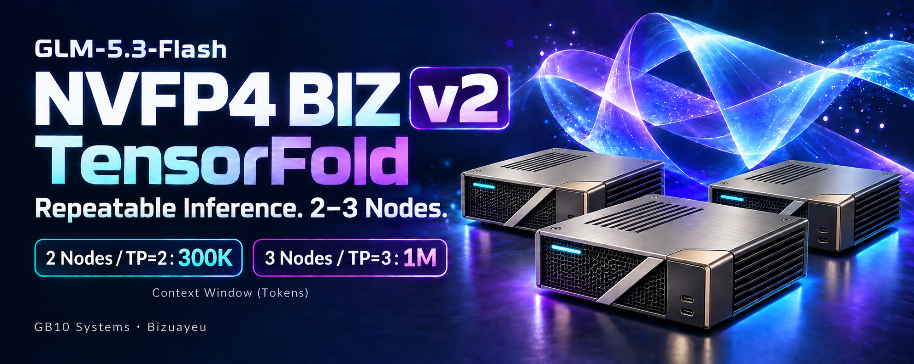

# NVFP4 BIZ 2.x（TensorFold）



[English](README.md) · [リポジトリの索引](../README.ja.md) · [セットアップ手順書](SETUP.ja.md) · [検証](docs/validation.ja.md) · [変更履歴](CHANGELOG.ja.md)

**NVFP4 BIZ** は、NVIDIAの固定したGLM-5.3-Flash NVFP4 checkpointを、再学習も再量子化もせず配布のまま、DGX Sparkまたは互換のGB10機で配信します。名前はこの意図を表し、エンジンには依存しません。2.x系はvLLMに代えて[TensorFold](https://github.com/ashhart/TensorFold)（Apache-2.0）で、2台のTP=2または3台のTP=3で配信します。2.0.0が最初のリリースです。[1.x系](../v1/README.ja.md)も並んで続きます。

**BIZ**は保守者の印で、リポジトリの意図を示す語です。意味することと意味しないことは[リポジトリのREADME](../README.ja.md#biz)にあります。

## 要約

- **何であるか。** 固定したcheckpointを、固定したTensorFoldのcommitで一つのOpenAI互換endpointとして配信するための、build手順・起動の台本・受け入れ検査です。2台なら直結のConnectX-7リンクでTP=2、3台ならswitchなしのリングでTP=3です。公開している測定値はMSI EdgeXpert（MS-C931）で取りました。
- **状態。** 2.0.0は2026-10-04に参照機で、[検証](docs/validation.ja.md)の基準値に対して両TPで受け入れました（[リリースでの測定値](#リリースでの測定値)）。以後のimageは、それぞれ[変更履歴](CHANGELOG.ja.md)の節が挙げるTPと検査で、同じ基準値に対して受け入れました。今のimage（2.5.0）はTP=2とTP=3・画像入力の有効で、固定のcheckpointと公開したAXLの重みの両方で受け入れています（[リリースでの測定値](#リリースでの測定値)）。主張の範囲はそこまでです。他の機体は同じ検査を回して確かめます。
- **反復性はエンジンの契約。** draftした応答はserialと同じ、再開したpromptは最初からと同じ、promptのchunkの切り方で結果が変わらない。これはエンジンの契約で、1.x系はvLLMの上でスイッチを入れて反復性を得ています（[1.x系との違い](#1x系との違い)）。
- **精度。** routed expertとdense MLPはW4A16、他はBF16、KVはFP8です。任意で使う公開したAXLの重みは、attentionのprojectionとheadもW4A16にします。NVIDIAのmodel cardは別のレシピ・別の機材でcheckpointを測っており、その精度表はこの配信を表しません。この配信を表す数字は[検証](docs/validation.ja.md)にあります。
- **ライセンス。** コードとエンジンはApache-2.0、重みはMITで運用者がダウンロードします。配信の経路に非商用の条件はありません（[ライセンスの早見表](../README.ja.md#ライセンスの早見表)）。
- **未検証。** 同時に2系列以上、[回した検査](#リリースでの測定値)を超える画像入力、公開したAXLの重みで回した検査（decode検査、NLL、編集の返答、長い入力、TP=2のtool-eval-bench）を超えるもの、ハーネス連携（ZCode・Claude Code）、他のrank数と機材、アプリケーション全体の品質と本番の信頼性（[制限](#制限)）。

## 何であるか

- **重み**：`nvidia/GLM-5.3-Flash-NVFP4` のrevision `423acf37583782c51c142d145aef733d72943d93`。1.x系と同じで、[Z.aiのGLM-5.3-Flash](https://huggingface.co/zai-org/GLM-5.3-Flash)から作られています。routed expertとdense MLPはcheckpointのNVFP4 blockからW4A16で、attention・shared expert・headはBF16のまま計算します。例外はエンジンの中の一つだけです：MTP層のrouted expertはcheckpointではBF16で、draft専用にNVFP4へ量子化します。draftしたtokenは全部本体のモデルが検証するので、応答は変わりません。このcheckpointが既定です。任意で使えるのは公開したAXLの重み（NVFP4 BIZ AXL、[1.x系](../v1/README.ja.md)の公開した任意設定）：`Bizuayeu/GLM-5.3-Flash-NVFP4-attn-lmhead-W4A16` のrevision `bbad98c8f380588c16a2326bf5a2ab7344190b07`（[`config/axl.lock.json`](config/axl.lock.json)）で、attentionのprojectionと `lm_head` をW4A16のNVFP4に詰め直し、他は固定のcheckpointのままのものです。rankのファイルの `CHECKPOINT` で選びます（[設定](#設定)）。
- **エンジン**：TensorFoldのBIZ版。[Bizuayeu/TensorFold](https://github.com/Bizuayeu/TensorFold) のbranch `release/2.5.0` として公開します。TensorFold v0.6.5に、GLMのNVFP4の読み込み（W4A16のNVFP4のattentionとheadも読み、公開したAXLの重みをそのテンソルのとおりに読む）、FP8 latent KV、TP=3の分割、ビットを変えないprefillの改善、prompt chunkの合間に熱で待つprefill、上流のpull request #194の画像入力（3 rankへ広げたもの）、tokenを変えないdecodeの改善（copy drafts〔外れた後も減らさない〕、KDAのdecodeの窓を3 kernelの経路で、BF16のdecodeの行列積の形ごとのタイル、読まれないDSAのkey・value行の複製を作らない）を足したものです。上流とそのレシピからは、pull request #301（止めた要求が全rankで1 round以内に終わる）、#421（長い会話の後に新しい会話が来ても保持promptを写しては捨てない）、#285（end tokenが `</tool_call>` より先に来たGLMのtool呼び出しを、全体がparseできれば送る）、#294（起動時に開けるファイル数の上限を上げる）と、本物の画像の隣で文字のままにする引用の `<|image|>`（MiaAI-Labのpatch 0080に倣う）を持ちます。TR3のcheckpointはbrandonmusicのものとして名指します（[決定の記録](docs/decisions.ja.md)）。imageはその一つのcommitに固定します（[`TENSORFOLD_REF`](docker/Dockerfile)）。
- **image**：[`docker/Dockerfile`](docker/Dockerfile)。NVIDIAのPyTorch container 26.07に、測定した版のpackage（transformers 5.18.0、構造化出力のxgrammar 0.2.8、Hugging Face hubのclient）とエンジンを入れます。
- **起動**：[`scripts/`](scripts/) のshellの台本と、rankごとの環境ファイル一つ（[`examples/`](examples/) に参照機のファイル）。順番は[SETUP.ja.md](SETUP.ja.md)にあります。

## 必要な環境

- **機体**：DGX Sparkまたは互換のGB10機を2台か3台（Linux ARM64、各128 GBの統合メモリ）。GPUで他の大きな仕事を動かさないこと。同じ機で1.x系のserverが動いていれば先に止めます。
- **fabric**：RoCE v2のConnectX-7リンク。2台は直結、3台はswitchなしのリング（[3台をリングにつなぐ](../docs/qsfp-network.ja.md#8-3台をリングにつなぐ)）。各portの2本のrailを両方使います。
- **ホストカーネル**：1.x系と同じです。今のDGX OSの更新が入れる既定のカーネルは、複数ノードのRoCEを壊すことがあります（[ホストカーネルと複数ノードRoCE](../docs/hosts.ja.md#ホストカーネルと複数ノードroce)）。
- **GPUクロック**は1.x系と同じく全機で上限を設けます（[GPUクロックの上限](../docs/hosts.ja.md#gpuクロックの上限)）。上限と温度の記録は[`host/`](../host/README.ja.md)が据え付けます。2.x系の数字は全部この上限の下で測りました。
- **Docker**：NVIDIAのGPU runtimeとRDMA deviceが要ります（`/dev/infiniband` が無い機では、NCCLがsocketに落ちるので `create_container.sh` が止まります）。
- **disk**：全機にcheckpointを丸ごと（1.x系と同じ。[導入するものと対応機体](../v1/README.ja.md#導入するものと対応機体)）と、image。公開したAXLの重みを配信する機ではそれも。
- **操作する機械**：全機へSSHでき、`cluster.sh` を動かす機械一台。
- **Python 3.11以上**：各機で、この系列の道具（[`glm53_tf/`](glm53_tf/)：ダウンロード、検証、tool引数ゲート、検査）を `v2/` から動かします（[手順書 §2](SETUP.ja.md#2-checkoutとcheckpoint)）。

## はじめ方

各段とその後に確かめることは[セットアップ手順書](SETUP.ja.md)にあります。以下はTP=2のときの骨組みです。全機で同じ、確認済みの `v2.*` のtagを使います。

```sh
# 一度だけ、ある1台の v2/ からその仮想環境で。その後cacheを他の機へ写し、写しごとに検証する（SETUP §2）
python -m glm53_tf download --background
python -m glm53_tf verify-download --hf .venv/bin/hf --output ../records/checksum --wait

# 各機で、checkoutのルートから（SETUP §3〜§5）。1台でbuildして他は `docker load`、image IDを比べる
docker build -f v2/docker/Dockerfile -t glm53-tf:2.5.0 .
v2/scripts/create_container.sh glm53-tf:2.5.0
cp v2/examples/tp2-rank0.env ~/glm53-tf/rank.env      # もう1台は tp2-rank1。その後この機の値に直す
docker exec glm53-tf bash /opt/glm53-tf/build_ext.sh

# 操作する機械で（SETUP §6・§9）
mkdir -p state && cp v2/examples/cluster.tp2.env state/cluster.env  # HOSTS（rank順）と CHECKOUT
v2/scripts/cluster.sh state/cluster.env start first    # first はlogの名前。rank 0のserving行でREADY
v2/scripts/cluster.sh state/cluster.env stop
```

rank 0はloopbackで答えます：

```sh
curl -s http://127.0.0.1:8095/v1/chat/completions -H 'Content-Type: application/json' -d '{
  "model": "glm-tf",
  "messages": [{"role": "user", "content": "Write a Python fibonacci function."}]
}'
```

モデルは答える前に考えます。思考は `reasoning_content`、答えは `content` に返るので、`max_tokens` を指定しない要求は両方で32,768 tokenまで使えます。小さい上限では思考の途中で終わり、`content` が空になることがあります。起動したら、日常の運用の前に[検証](docs/validation.ja.md)の検査（まずdecode検査）で受け入れます。

**安全。** `serve.sh` はrank 0を `127.0.0.1` で待ち受けさせ、[tool引数ゲート](SETUP.ja.md#7-tool引数ゲート任意)もloopbackだけで待ち受けます。SSHのtunnel（`ssh -L 8095:127.0.0.1:8095 <rank 0>`）か、認証を足すproxyを通して使ってください。loopbackの外で配信する（rankのファイルで `HOST=0.0.0.0`）ときは、API keyも設定します。rank 0のrankのファイルに `TENSORFOLD_API_KEY=<key>` の行を書くと（例のファイルではコメントにしてあります）、エンジンは `Authorization: Bearer <key>` の無い要求をすべて拒みます。`/metrics` も同じで、`/health` だけは開いたままです。この系列のdecode検査、`score-nll`、`bench`、`long-input` は、走らせる側で `TENSORFOLD_API_KEY` が設定されていればkeyを送り、tool引数ゲートはそのheaderをそのまま渡します。keyは平文のファイルに置く秘密なので、rankのファイルは持ち主だけが読めるようにします（`chmod 600`）。keyなしで `HOST=0.0.0.0` にすると、APIは認証なしで外に出ます。

## 配信の既定

[`scripts/serve.sh`](scripts/serve.sh) が持ち、全rankで同じです。

| 設定 | TP=2（2台） | TP=3（3台） |
|---|---|---|
| KV cache | latentとindexerのpool keyをFP8（`TF_GLM_KV=fp8`） | 同じ |
| draft | checkpointのMTP head（`--drafter none`：DFlash2は使わない） | 同じ |
| 窓（`--context`） | 300,000 token | 0＝収まる最大：参照機のリングで1,048,576（モデルの上限） |
| 要求が指定しないときの応答の上限 | 32,768 token（`--max-tokens`） | 同じ |
| NCCL | 各リンク2本のrail・4 channel・IBのtransportを明示、rankごとのファイルから | 2本のrail・4 channel・IBのtransportを明示・subnet-aware routing |
| 画像入力 | 有効：全rankのファイルの `VISION=1` で `--vision` が付く。rank 0が画像のtower（1.05 GiB）を持ち、他の会話の保持promptは3 GiBのうち2.4 GiBになる | 有効。保持promptは3 GiBのまま |
| rank間のprefillの交換 | エンジンの既定 `split` | 同じ |
| 熱によるprefillの休止 | chunkの合間に全rankそろって、どれかのrankのACPIの最高温度が92 °Cを超えたら、全rankが88 °C以下になるまで待つ（`TF_GLM_HEAT_HIGH`／`TF_GLM_HEAT_LOW`）。その温度に直前のchunkの上がり幅を足すと93 °Cを越えるときも、越えなくなるまで待つ（`TF_GLM_HEAT_CEILING`） | 同じ |
| 他の会話の保持prompt | エンジンの既定：8本、3 GiB | 同じ |

**TP=2を300,000にする理由。** `--context 0` では対の窓が567,255 tokenになり、他の会話の保持promptに何も残りませんでした。長い履歴を送り直すチャットやエージェントでは保持が効きます。エンジン自身のメモリの見積もりでは、300,000 tokenは567,255に比べてrankあたり約3.3 GiBを空け、既定の3 GiBの保持promptが収まります。1.x系は262,144 tokenですが、それには合わせていません。別の窓にするには `serve.sh` に `--context` を渡します（最後のflagが効きます）。対が持てる最大は約567Kです。

## 設定

配信は三か所で決まります。二つのファイルは [`examples/`](examples/) から写して自分の値に直し、Gitには入れないでください。

| 場所 | 設定 | 既定 | 意味 |
|---|---|---|---|
| rankのファイル（`/work/rank.env`、`serve.sh` が読む） | `MASTER` | なし（必須） | リンク上のrank 0のaddress。全rankで同じ |
| | `NCCL_IB_HCA`・`NCCL_IB_GID_INDEX`・`NCCL_SOCKET_IFNAME` | 参照機の値 | リンクのRDMA device（両rail）、RoCE v2のGIDの番号、bootstrapのinterface |
| | `NCCL_NET`・`NCCL_IB_DISABLE`・`NCCL_IB_ROCE_VERSION_NUM`・`NCCL_IB_ADDR_FAMILY`・`NCCL_SOCKET_FAMILY`・`NCCL_MIN_NCHANNELS`・`NCCL_MAX_NCHANNELS` | RoCE v2とIPv4の上のNCCLのIBのtransport、4 channel | NCCLが気づかれずにsocketへ落ちないように明示します。4 channelでTP=2のdecodeは+1%、起動時の余地も増えました（[採否](docs/decisions.ja.md#fabric)）。TP=3はsubnet-aware routingと、NCCL自身のIBのtransportを使う `NCCL_NET_PLUGIN=none` が加わります（[`tp3-rank0.env`](examples/tp3-rank0.env)） |
| | `VISION` | 例のファイルは `1`（無ければ `0`） | 画像入力（`serve.sh` が `--vision` を足す）。`0` で無効。全rankで同じ値 |
| | `NCCL_DEBUG`・`NCCL_DEBUG_SUBSYS` | `INFO`・`INIT,NET` | NCCLが起動時に各接続のtransportを一度だけ書き、[SETUP §6](SETUP.ja.md#6-起動)がそれを読みます |
| | `MODEL_NAME`・`HOST`・`PORT` | `glm-tf`・`127.0.0.1`・`8095` | rank 0のmodel idと待ち受け |
| | `CHECKPOINT` | `/hub` の下の固定snapshot | container内のcheckpointのdirectory。`/hub/models--Bizuayeu--GLM-5.3-Flash-NVFP4-attn-lmhead-W4A16/snapshots/bbad98c8f380588c16a2326bf5a2ab7344190b07` で公開したAXLの重みを配信します（取得は[手順書 §2](SETUP.ja.md#2-checkoutとcheckpoint)）。全rankで同じ値にします（違えば起動を断ります） |
| | `TF_GLM_HEAT_HIGH`・`TF_GLM_HEAT_LOW` | `92`・`88`（°C） | prefillの熱の待ち。全rankで同じ値、空にすると待たない |
| | `TF_GLM_HEAT_CEILING` | `93`（°C） | 待ちの見込み：最高温度に直前のchunkの上がり幅を足した値をこの温度以内に保つ。帯が要る。全rankで同じ値、空にすると見込まない |
| | `TF_GLM_CACHE_GIB` | `3`（エンジンの既定） | 窓の残りのうち、他の会話の保持promptに使うrankごとのメモリの上限。全rankで同じ値 |
| | `TF_GLM_CACHE_ENTRIES` | `8`（エンジンの既定） | 他の会話の保持promptの本数。別の値にしたらdecode検査にも同じ値を渡します（[decode検査](docs/validation.ja.md#decode検査)） |
| | `TF_GLM_COPY_DRAFTS`、`TF_GLM_KDA_DECODE_WIDE`、`TF_GLM_B16_DECODE_TABLE` | `1`（エンジンの既定） | copy drafts、KDAのdecodeの経路、BF16のdecodeのタイル（[決定の記録](docs/decisions.ja.md)）。`0` でそれぞれを切ります。どちらでもtokenは同じです。全rankで同じ値にします（違えば起動を断ります） |
| `serve.sh` の引数 | `TP RANK RANK_ENV` の後 | なし | 既定の後ろで `tensorfold serve` に渡るので、こちらが勝ちます（`--context 500000`） |
| clusterのファイル（`cluster.sh`） | `TP`・`HOSTS`・`CHECKOUT` | なし（必須） | TPの大きさ、rank順のSSH名、各機上のこのリポジトリのルート（1.x系の `--checkout` はその `v1/` を指す） |
| | `SSH`・`CONTAINER`・`WORK` | `ssh -o ConnectTimeout=20`・`glm53-tf`・`$HOME/glm53-tf` | 機への入り方、container、`/work` に見せる機のdirectory |
| `create_container.sh` | `IMAGE [WORK_DIR]`・`CONTAINER`・`HF_HUB` | `~/glm53-tf`・`glm53-tf`・`~/.cache/huggingface/hub` | image、作業directory（rankのファイル・extension・log）、container名、`/hub` に読み取り専用で見せるHugging Faceのcache |

rankのファイルは `bash` が全変数をexportしながら読むので、他の `TF_GLM_*` や `NCCL_*` の設定もエンジンに届きます。この表に無い設定は、この系では測っていません。

## API

rank 0がエンジンのHTTP APIを出します。受け入れで使ったもの：

- **`/v1/chat/completions`**：streamとそれ以外、toolと構造化出力（tool-eval-benchのTC-64〜TC-69。imageにxgrammarが要ります）を、[tool引数ゲート](SETUP.ja.md#7-tool引数ゲート任意)越しに。
- **思考**：検査が送る形の `chat_template_kwargs.reasoning_effort` と `clear_thinking`。streamでは1つのdeltaに `reasoning_content` と `content` の両方が乗ることがあります（[制限](#制限)）。
- **`"draft": false`**：要求のbodyに入れると1 roundに1 tokenずつdecodeします。draftした応答が一致すべきserialの基準です。
- **応答の `tensorfold` block**：`accepted`・`drafted`・`rounds`（MTPの受理）、`cached`（保持promptから再開したprompt token数）、`prefill_s` と `heat_wait_s`、copy draftsの `copy_rounds`・`copy_drafted`・`copy_accepted`、`sha256`（応答のtoken idのhash）。
- **`/health`**（decodeの `rounds` など）と **`/metrics`**。
- **停止**：クライアントの切断やstop文字列で、全rankのdecodeが1 round以内に終わります。
- **画像**（`VISION=1`）：data URLの `image_url` を、userのメッセージとtoolの結果で受けます。動画は400で拒みます。

NLLの検査は **`/v1/models`**（採点するモデル）と **`/v1/completions`**（`prompt_logprobs` つきの教師強制）も使います。エンジンは `/v1/responses`・Anthropicの `/v1/messages`・`/tokenize` にも答えますが、2.0.0の受け入れでは確かめていません。

## 1.x系との違い

| | 1.x（vLLM） | 2.x（TensorFold） |
|---|---|---|
| 出力の反復性 | vLLMの[再現性のスイッチ](../v1/docs/server-configuration.ja.md#再現性のスイッチ)を入れる | エンジンの契約：draftした応答はserialと同じ、再開したpromptは最初からと同じ、promptのchunkの切り方で結果が変わらない |
| KVと窓 | FP8、262,144 token（rankあたり3 GiB） | latentとindex keyをFP8、TP=2で300,000 token、TP=3で1,048,576 |
| 起動 | `glm53_setup` が一つのserver TOMLを読む。`server preflight`・`cluster switch`・warmupの段階 | ここの台本。preflightや切替は無い |
| 同時に処理する系列 | 1、公開した任意設定の2系列profileで2 | 1 |
| 画像入力 | 受ける | 受ける（例のrankのファイルは `VISION=1`） |
| 公開したAXLの重み | 任意で使える | 2.4.0から任意で使える（全rankのファイルの `CHECKPOINT`）。1系列で |
| tool呼び出し | モデルのAPI、任意でtool引数ゲート越し | 同じゲートのこの系列の写しを `v2/` から起動してエンジンの前に置く |
| 長いprefill中の熱 | エンジンの中に待ちは無い。測定では要求の合間に冷却gateでホストを休ませた（今は[`host/`](../host/README.ja.md#長い運転の間)にあるもの） | エンジンがprompt chunkの合間に全rankそろって待つ（92 °Cで待ち、88 °Cで再開。最高温度に直前のchunkの上がり幅を足すと93 °Cを越えるときも待つ。[配信の既定](#配信の既定)） |

2.x系の各設定を選んだ理由と、試して採らなかったものは[決定](docs/decisions.ja.md)にあります。

## リリースでの測定値

**2.5.0**（2026-10-08、エンジン `8a36b2c`、image `glm53-tf:2.5.0`）。`bench --kinds decode` は上限まで数える新しい要求を送り（[ベンチマークの方法](docs/benchmarks.ja.md#prefillとdecodeの速さ)）、エンジンは上流のpull request #285と#294、本物の画像の隣で文字のままにする引用の `<|image|>`、TR3の新しい名を取り込みました。既定の経路（画像なし・toolなし）のtokenは2.4.0と同じです（[決定の記録](docs/decisions.ja.md#エンジン)）。両方の重み・両TPで画像入力を有効にして、decode検査は2.4.0のtoken idを、`bench --kinds edit` は基準の返答を出し、TP=2のNLLの組は両方の重みで2.4.0と4桁まで同じでした。固定の重みでは両TPで画像の検査がすべて合格し、引用の `<|image|>` を本物の画像の隣に含む会話は200を返して画像を読みました。

| 2.5.0、画像入力の有効 | 固定、TP=2 | AXL、TP=2 | 固定、TP=3 | AXL、TP=3 |
|---|---|---|---|---|
| decode検査 count／prose／code（tok/s） | 43.59／27.37／35.71 | 57.03／37.45／44.70 | 58.82／38.04／48.46 | 71.97／48.83／59.70 |
| MTPの受理長（同じタスク） | 3.961／2.098／3.180 | 3.813／2.004／2.893 | 4.056／2.222／3.234 | 3.631／2.060／2.994 |
| `bench --kinds decode`、2.5.0の要求（tok/s、中央値） | 42.63 | 57.09 | 56.73 | 76.55 |
| `bench --kinds edit`（tok/s、中央値） | 57.81 | 74.20 | 76.26 | 96.50 |
| 38,960 tokenのprefill（s、2本） | 30.17／29.32 | — | 24.24／23.45 | — |
| 長い入力（262Kと1M token）、1M tokenのtool gate | — | — | — | — |
| rank 0の起動の見積もり（GiB） | 101.35 | 96.71 | 81.93 | 78.68 |
| teacher-forced NLL 日／英／コード／数学 | 2.5474／2.9257／1.3184／0.6250 | 2.5556／2.9438／1.3334／0.6474 | — | — |
| tool-eval-bench、直／tool引数ゲート越し | 92／93 | 89／91 | — | — |

- **`bench --kinds decode`。** どの行も上限で止まり（`finish_reason` `length`、512 token）、各起動の3回の返答は同じでした。TP=2では両方の重みが同じ返答を出し、AXLは固定の重みより34%速い値でした。この行は以前のリリースの `bench --kinds decode` とは比べられません。前の要求ではmodelが返答を自分で終え、その後に作った文をdecodeしていました。
- **TP=3の固定の重み。** TP=3の固定の重みの返答も上限まで数えますが、数える前の思考が41 tokenでAXLより11 token長いので、TP=3の返答はtokenまで同じではなく、そこでのAXLの固定の重みより35%速い値は、同じ文どうしではなく2つの数える文の比べです。
- **tool-eval-bench**（TP=2、69シナリオ、[検証](docs/validation.ja.md#tool引数ゲート越しのtool)の呼び方）。直では両方の重みがTC-43（`web_search` の空の `query`）でSafety Gateを通らず、ゲート越しでは両方とも通過しました。2.4.0と同じ点と出方です。
- **このリリースで測っていないもの**（`—`）。既定の経路のtoken idは両TPで2.4.0と同じなので、2.4.0のTP=3のNLL、長い入力、1Mのtool gateの結果がこのエンジンにも当てはまります。AXLのprefillと、AXLでの画像の検査は回していません。
- **2.4.0との差。** decode検査と編集は、両方の重み・両TPで−0.8〜+0.1%でした。
- **prefill。** 固定の重みのTP=2の2本のうち、1本目が2本目より2.9%長くかかりました。prefillの2つの速さは未解決のままです（[検証](docs/validation.ja.md#prefillとdecodeの速さ)）。

**2.4.0**（2026-10-08、エンジン `ab8e741`、image `glm53-tf:2.4.0`）。公開したAXLの重みを任意で配信でき、copy draftsは外れた後に減らしません（`MISS_MOST` 5）。固定のcheckpointでは他は2.3.0のエンジンで、同じtokenを出します（[決定の記録](docs/decisions.ja.md#精度とメモリ)）。両方の重み・両TPで画像入力を有効にして、decode検査はその重みの基準のtoken idを、NLLの組は下の値を、`bench --kinds edit` は基準の返答を出し、画像の検査は固定の重みですべて合格しました。

| 2.4.0、画像入力の有効 | 固定、TP=2 | AXL、TP=2 | 固定、TP=3 | AXL、TP=3 |
|---|---|---|---|---|
| decode検査 count／prose／code（tok/s） | 43.80／27.54／36.01 | 57.30／37.53／44.80 | 59.20／38.19／48.68 | 71.89／49.03／59.90 |
| MTPの受理長（同じタスク） | 3.961／2.098／3.180 | 3.813／2.004／2.893 | 4.056／2.222／3.234 | 3.631／2.060／2.994 |
| `bench --kinds decode`（tok/s、中央値） | 36.82 | 37.57 | 55.68 | 68.00 |
| `bench --kinds edit`（tok/s、中央値） | 58.13 | 74.26 | 76.40 | 96.75 |
| 38,960 tokenのprefill（s、2本） | 30.22／29.59 | 28.73／28.81 | 24.51／23.52 | 23.22／22.86 |
| 262,113 tokenの3か所の合言葉 | — | 3/3、最初のtokenまで227.5 s（うち熱の待ち8.0 s） | — | — |
| 1,035,295 tokenの3か所の合言葉 | — | — | 3/3、最初のtokenまで1,588.4 s（うち熱の待ち480.5 s） | 3/3、最初のtokenまで1,524.1 s（うち熱の待ち454.4 s） |
| rank 0の起動の見積もり（GiB） | 101.35 | 96.71 | 81.93 | 78.68 |
| teacher-forced NLL 日／英／コード／数学 | 2.5474／2.9257／1.3184／0.6250 | 2.5556／2.9438／1.3334／0.6474 | 2.5313／2.9001／1.3101／0.6237 | 2.5590／2.9471／1.3357／0.6439 |

- **重み。** AXLは両TPで固定の重みより速く、NLLは高い値でした。タスクの水準の品質はこの受け入れでは測っていません。decode検査のtoken idはAXL自身の基準で（[検証](docs/validation.ja.md#decode検査)）、TP=2では2回の起動で同じ、編集の返答は固定の重みと同じです。TP=2のAXLの `bench --kinds decode` だけは固定の重みより2%速いにとどまり、decode検査と編集は5分の1以上速い値でした。原因はリリースの後に分かり、要求にありました：両方の重みとも約100 tokenで自分で数えるのを終え、512の残りはそれぞれのmodelが自分の終わりの後に作った会話で、重みによって違ったので、この行は違う文を比べていました。2.5.0の要求は上限まで数えます（上の2.5.0）。
- **熱。** 固定の重みでは最も熱い機の最高が92.6 °Cで、2.3.0と同じです。AXLのTP=3の1M tokenのpromptの間に、受け入れで毎秒取ったホストの温度の記録で、1台が1回94.4 °Cを読みました（2秒ごとに読む熱の見張りの記録では93.5 °C）。始めて約4分、90.5〜91 °Cで30秒以上横ばいの後でした：そのchunkの前の確認は92 °C未満で、直前のchunkの上がり幅がほぼ0だったので、見込みは待たせませんでした。次の確認で待ちに入り、以後の待ちは12〜15 °Cの上がり幅を見込みました。熱の見張りはエンジンを止めていません。1秒で待ちに入ったので、この読みは許容しました（[Next Action](#next-action)）。
- **1M tokenでのtool gate**（固定、TP=3）。1回目は1,553.3 s後に200（うち熱の待ち448.4 s）で `tool_calls`、修復の2回目は保持promptから3.6 sで200でした。
- **2.3.0との差。** 固定の重みで、編集はTP=2で1.1%（57.49 → 58.13 tok/s）、TP=3で0.2%（76.22 → 76.40）速く、decode検査と `bench --kinds decode` は±1.3%以内でした。
- **prefill。** 固定の重みのTP=2の2本のうち、1本目が2本目より2.1%長くかかりました。prefillの2つの速さは未解決のままです（[検証](docs/validation.ja.md#prefillとdecodeの速さ)）。

**2.3.0**（2026-10-07、エンジン `7410d1d`、image `glm53-tf:2.3.0`）。prefillの熱の待ちが1 chunk先も見込みます（`TF_GLM_HEAT_CEILING` 93 °C）。他は2.2.0のエンジンで、同じtokenを出します（[決定の記録](docs/decisions.ja.md#熱)）。両TPで画像入力を有効にして、decode検査は基準のtoken idと文字列を、NLLの組は基準の値を出し、画像の検査はすべて合格しました。

| 2.3.0、画像入力の有効 | TP=2 | TP=3 |
|---|---|---|
| decode検査 count／prose／code（tok/s） | 43.61／27.32／35.69 | 58.44／38.14／48.71 |
| MTPの受理長（同じタスク） | 3.961／2.098／3.180 | 4.024／2.222／3.234 |
| `bench --kinds decode`（tok/s、3回の中央値） | 36.54 | 55.40 |
| `bench --kinds edit`（tok/s、3回の中央値） | 57.49 | 76.22 |
| 38,960 tokenのprefill（tok/s） | 1,254.3／1,329.9 | 1,559.9／1,665.6 |
| 1,035,295 tokenの3か所の合言葉 | — | 3/3、最初のtokenまで1,440.6 s（うち熱の待ち350.3 s） |

- **熱。** 1M tokenのpromptの間、最も熱い機の最高は92.6 °Cで、94 °Cを読んだ機はありません（2.2.0は1回94.3 °C）。終盤のchunkは4〜8.6 °C上がるので、見込みがその前に84〜88 °Cまで待ちました：待ちは350.3 s（2.2.0は64.1 s）、待ちを除いたprefillは1,089 s（2.2.0は1,090 s）。
- **prefill。** 両TPで2本のうち1本目が2本目より低い値でした（TP=2で5.7%、TP=3で6.3%）。prefillの2つの速さは未解決のままです（[検証](docs/validation.ja.md#prefillとdecodeの速さ)）。

**2.2.0**（2026-10-06、エンジン `440e631`、image `glm53-tf:2.2.0`）。tokenを変えないdecodeの改善：copy drafts、KDAのdecodeの窓を3 kernelの経路で、BF16のdecodeの行列積の形ごとのタイル、読まれないDSAのkey・value行の複製を作らない（[決定の記録](docs/decisions.ja.md#decode)）。両TPで画像入力を有効にして、decode検査は基準のtoken idと文字列を出し、画像の検査はすべて合格しました。countの受理長は上がり（copy drafts）、他は変わりません。

| 2.2.0、画像入力の有効 | TP=2 | TP=3 |
|---|---|---|
| decode検査 count／prose／code（tok/s） | 43.69／27.42／35.80 | 58.52／38.11／48.70 |
| MTPの受理長（同じタスク） | 3.961／2.098／3.180 | 4.024／2.222／3.234 |
| `bench --kinds decode`（tok/s、3回の中央値） | 36.56 | 55.68 |
| `bench --kinds edit`（tok/s、3回の中央値。A/BでのTP=2のcopy drafts有効／無効） | 57.43（A/B 57.6／43.0） | 76.29 |
| 38,960 tokenのprefill（tok/s） | 1,285.3／1,290.6 | 1,607.1／1,668.8 |
| 1,035,295 tokenの3か所の合言葉 | — | 3/3、最初のtokenまで1,154.3 s（うち熱の待ち64.1 s） |

- **熱。** 1M tokenのpromptの終わり近くで、1台が1回だけ1秒、94.3 °Cを読みました。そのあたりではprompt chunk一つでchunkの合間の確認の後に約7 °C上がります。待ちで2秒後に78.5 °Cまで下がり、熱の見張り（94 °C以上が2回続いたら止める）は止めませんでした。待ちを除いたprefillは1,090 sで、2.0.0は1,095 s：熱の振る舞いはこの版の変更ではありません（[Next Action](#next-action)）。
- **prefill。** TP=2の2本はA/Bの1,326〜1,332 tok/sより約3%低く、TP=3の1本目は2本目より約3.7%低い値でした。prefillの2つの速さは未解決のままです（[検証](docs/validation.ja.md#prefillとdecodeの速さ)）。

**2.1.4**（2026-10-06、エンジン `a265436`、image `glm53-tf:2.1.4`）。長い会話の後に新しい会話が来ても、保持promptを写しては捨てることがなくなりました（TensorFoldのpull request #421）。TP=2・画像入力を有効にして、decode検査は2.1.1のtoken idと文字列を出し、画像の検査はすべて合格しました。11 turnで247,330 tokenの会話の後に新しい会話を送っても、`MemAvailable` はrank 0で11〜12 GiB、rank 1で12〜15 GiBのままでした。

**2.1.1**（2026-10-05、エンジン `1a3fb17`、image `glm53-tf:2.1.1`）。要求の画像は1枚ごとに画像のtowerを呼びます。TP=2・画像入力を有効にして、decode検査は2.1.0のtoken id・文字列・受理長を出し、画像の検査はすべて合格でした。同じ大きさの2枚の画像は、1枚ずつでもまとめてでも同じに読みました。

| 2.1.1、TP=2、画像入力を有効 | |
|---|---|
| decode検査 count／prose／code（tok/s） | 41.62／27.03／35.37 |
| 38,960 tokenのprefill、冷まさずに3回続けて（tok/s） | 1,327.0／1,326.8／1,322.8 |

**2.1.0**（2026-10-05、エンジン `9a1c7cc`、image `glm53-tf:2.1.0`）。エンジンを上流のv0.6.5へ載せ直して画像入力を足し、TP=2はNCCLを4 channelにしました。両TPでdecode検査は2.0.0のtoken idと受理長を出しました（文字列の新しいhashは[検証](docs/validation.ja.md#decode検査)にあります）。画像入力の無効と有効のどちらでも同じです。TP=2のNLLの採点セットは2.0.0と全精度で同じでした。下の表で断りの無い行は2.0.0の値です。promptとdecodeの経路が同じtokenを出すので、他の測定は繰り返していません。

| 2.1.0 | TP=2 | TP=3 |
|---|---|---|
| decode検査 count／prose／code（tok/s） | 41.67／27.02／35.38 | 52.37／37.92／48.41（画像入力を有効） |
| 38,960 tokenのprefill（tok/s、3回のうち2回目と3回目。1回目は1,221.5） | 1,331.1／1,329.9 | — |
| [画像の検査](docs/validation.ja.md#画像入力)（`VISION=1`） | すべて合格 | すべて合格 |

**2.0.0。** 2026-10-04に参照機（MSI EdgeXpert、GPUクロックの上限2,200 MHz）で取りました。エンジンは、リリース（`b44c2f1`）、その1つ前（表示の行だけが違う）の版、または熱の待ちを入れる前の版です。熱の待ちはprompt chunkの走る時刻しか変えません。どの行がどれかは注に書きました。手順と基準値は[検証](docs/validation.ja.md)にあります。1.xの列は[1.x系のベンチマーク](../v1/docs/benchmarks.ja.md)から、そのNLLは[1.26.0の配布既定でのNLL採点セット](../v1/docs/benchmarks.ja.md#1260の配布既定でのnll採点セット2026-10-02)から取りました。

| 測定 | TP=2 | TP=3 | 1.x |
|---|---|---|---|
| decode検査 count／prose／code（tok/s） | 41.04／26.73／34.85 | 52.47／37.99／48.47 | TP=2配布既定 32.59／21.12／28.21、TP=3 AXL 51.00／30.10／39.48 |
| 同じタスクのMTP受理長 | 3.821／2.098／3.180 | 3.549／2.222／3.234 | — |
| 38,960 tokenのprefill（tok/s、3回の中央値。TP=3は各回の前に冷却、TP=2は1回冷やした後に3回続けて） | 1,329.9 | 1,668.5（熱の待ちを切ると1,671.4） | TP=2配布既定 1,233.4（38,962 token） |
| 短い固定promptの後の512 tokenのdecode（tok/s） | 35.31 | 52.93 | TP=2配布既定 27.18 |
| 窓（token） | 300,000（`--context 0` なら567,255） | 1,048,576 | 262,144（TP=2） |
| 199,652 tokenの合言葉 | 正答、最初のtokenまで163.7 s | 正答、最初のtokenまで133.2 s | TP=3 AXL 150.5 s |
| 1,036,859 tokenの3か所の合言葉 | — | 3/3、最初のtokenまで1,264.8 s（うち熱の待ち170.1 s） | TP=3 AXL 1,058 s（1,038,423 token） |
| NLL採点セット（`config/nll_set.json`）でのteacher-forced NLL 日／英／コード／数学 | 2.5474／2.9257／1.3184／0.6250 | 2.5313／2.9001／1.3101／0.6237 | TP=2配布既定（1.26.0）2.5412／2.9079／1.3145／0.6285 |
| tool引数ゲート越しのtool-eval-bench | 93/100、Safety Gate通過 | 91/100、Safety Gate通過 | TP=2 AXL 90/100 |
| 応答の途中のクライアント切断やstop文字列 | 1 round以内に止まり、次の要求がすぐ始まる | 同じ | — |

- **反復性。** TP=2とTP=3の出力は、互いにも1.x系ともビット一致しません。rank間の和の分け方が違うためです。それぞれは自分自身と一致します。起動の中でも、起動をまたいでも、railが1本でも2本でも、熱の待ちが起きている最中でも、decode検査はタスクごとに一つのcompletionでした（[基準のhash](docs/validation.ja.md#decode検査)）。NLLは、リリース前の版で取った[基準値](docs/validation.ja.md#teacher-forced-nll)と全精度で同じでした。
- **どのエンジンで測ったか。**
  - decode検査は、TP=2がリリース、TP=3がその1つ前（表示の行だけが違う）の版です。
  - TP=3のprefillと1M tokenのpromptは、リリースの1つ前（表示の行だけが違う）の版です。
  - 他の行は、熱の待ちを入れる前の版です。
- **熱。** 1M tokenのpromptの間、最も熱い機は92 °C前後にとどまり、数秒ずつ約80回待って、最高は92.8 °Cでした。待ちが無いと、同じpromptは6分半で94 °Cに達し、[熱の見張り](../host/README.ja.md#長い運転の間)がエンジンを止めました。prefillは約7.5%違う2つの速さのどちらかで走り、どちらになるかは熱では説明できません（[prefillとdecodeの速さ](docs/validation.ja.md#prefillとdecodeの速さ)）。長い要求の合間には機を冷やしてください。
- **tool-eval-bench**は、1.x系と同じ69シナリオと呼び方で回しました。両TPともTC-61だけ失敗しました。

## 制限

- **一度に1系列。** エンジンのCUDAの経路はGLMの要求を一本ずつdecodeし、他は順番を待ちます。
- **TP=2では画像がメモリを取ります。** 画像入力が有効だとtowerの分だけ、他の会話の保持promptのメモリが減ります（[配信の既定](#配信の既定)）。全rankで `VISION=0` にすると3 GiBに戻ります。
- **公開したAXLの重みは品質と引き換えに速さを取ります。** NLLは採点セットのどの領域でも高い値で、TP=2のtool-eval-benchは直で89、tool引数ゲート越しで91でした（固定の重みは92と93。[リリースでの測定値](#リリースでの測定値)）。2.x系ではHLEを回していません。全rankで同じcheckpointを配信します。
- **TP=3はDFlash2とEXL3を拒みます。** どちらも2 rankにしか分割できません。この系列はどちらも使いません：`serve.sh` は `--drafter none` を渡し、checkpointはNVFP4です。
- **streamの応答。** draftがあると1 roundが思考から本文へまたがることがあり、1つのdeltaに `reasoning_content` と `content` の両方が乗ります。deltaごとに片方しか読まないクライアントは文を落とします。streamでない応答は欠けません。
- **FP8 KVはBF16 KVに対して損失があります**（1.x系も同じ）。draftした応答はserialと同じままです。短い4本の文章では、二つのcacheのNLLの差は0.011以内でした（2026-10-02）。
- **ConnectX-7のリンクでつないだ2台か3台**で、1.x系と同じです。他のrank数、他の機材、同時の要求は測定の範囲外です。

## リポジトリの構成

2.x系のファイルは `v2/` にあります。imageはライセンスのあるcheckoutのルートからbuildし、Pythonの道具は `v2/` から `python -m glm53_tf <command>` で動かします。ホストのツールと、全系共通のホストとfabricの文書はcheckoutのルートにあります（[`host/`](../host/README.ja.md)、[`docs/`](../docs/README.ja.md)）。

```
v2/
  README.md         このページ（各 .md の隣に .ja.md）
  SETUP.md          セットアップ手順書
  CHANGELOG.md      2.x系のリリース。v2.* のtagがその節を公開する
  glm53_tf/         Pythonの道具：download・verify-download・tool-gate・
                    decode-check・decode-divergence・score-nll・bench・long-input
  config/           model.lock.json（固定のcheckpoint）、axl.lock.json（公開したAXLの重み）、
                    nll_set.json（NLL採点セット、1.x系のもののbyte単位の写し）
  requirements/     huggingface.lock.txt：ダウンロードとその検証に使うHugging Faceのclient
  docker/           Dockerfile：image。エンジンは TENSORFOLD_REF で固定
  scripts/          create_container.sh  各機の配信用container
                    build_ext.sh         エンジンのCUDA extension（imageごとに一度）
                    serve.sh             1 rank、配信の既定つき
                    cluster.sh           操作する機械から全rankを起動・停止・状態確認
                    hostwatch.sh         メモリの見張り（MemAvailableが5 GiBを切るとエンジンを止める）
  examples/         参照機のrankのファイルとclusterのファイル（TP=2とTP=3）
  docs/             validation.md  受け入れの検査と基準値
                    benchmarks.md  リリースの値の取り方
                    operations.md  失敗と日常の作業：止まったrank、新しいimage、ホストを1.x系へ渡す
                    decisions.md   2.x系で試したこと、採ったこと・採らなかったこととその理由
  tests/            glm53_tf/と、これらの頁が引く事実のCPUテスト
  pyproject.toml    2.x系の版
```

## TensorFoldの他のレシピ

GLM-5.3-FlashをTensorFoldで配信する公開レシピです。各レシピのリンク、2026-10-04に確認したライセンス、この系列が取り込んだものは、この表が正典です。他のエンジンのレシピは[1.x系の表](../v1/README.ja.md#dgx-spark向けの他のglm-53-flashレシピ)にあります。それぞれの測定は別の重みと設定によるもので、上の数字とは比べられません。

| レシピ | ライセンス | この系列が取り込んだもの |
|---|---|---|
| [ashhart/TensorFold](https://github.com/ashhart/TensorFold) | Apache-2.0（0.5.0まではMIT） | エンジンそのもの。リリースのbranchは上流v0.6.5に自前のcommitを足したものです。上流はPython版のエンジンを凍結し（issue #286）、2026-10-06にこの系列のissueとpull requestのすべてに返事しました：0.6.xには入らない。新しい作業の行き先のZig版は、GLMを移したときに#308・#310・#339・#333・#396〜#399の設計に倣い、lossyなFP8のcacheは採らない（#309、#401） |
| [MiaAI-Lab/GLM-5.3-Flash-EXL3-2x-DGX-Sparks-TensorFold](https://github.com/MiaAI-Lab/GLM-5.3-Flash-EXL3-2x-DGX-Sparks-TensorFold) | Apache-2.0 | FP8 latent KVはそのpatch 0038に倣い、v0.6.x上で書き直して、エンジンの表示にクレジットしています（上流のissue #309）。copy draftsはそのpatch 0007と0032の前半に、KDAのdecodeの窓は0016cに倣い、同じくクレジットしています。TP=3の分け方はpatch 0066と同じ規則です（単位の境界で切り、余りを若いrankへ）。上流のpull request #301（止めた要求が全rankで終わる）と#285（end tokenが `</tool_call>` より先に来たGLMのtool呼び出し、2.5.0から）はそのままリリースに入っています。会話に引用された画像の印を本物の画像の隣で文字のままにするのは、そのpatch 0080に倣った書き直しです。自前のEXL3 checkpointをDFlash2のdraftで、同時に最大8要求、画像と動画の入力つきで配信しています |
| [jakejharris/jspark3 v2.0.1](https://github.com/jakejharris/jspark3/releases/tag/v2.0.1) | Apache-2.0（レシピ）、MIT（そのエンジン＝TensorFold 0.3.6.2のfork） | 何も取り込んでいません。自前のTensorFoldのforkで、4-bitのMLX形式の重みを3台に分けてTP=3で配信します。既定はDFlash2のdraftで、商用には `--drafter none` の経路を示しています。会話の状態をdiskに保存するcacheを持ち、RigMarkで測っています |

## 免責事項

- **BIZは意図であり、約束ではありません**（[リポジトリのREADME](../README.ja.md#biz)）。
- **受け入れは参照機のものです。** 他の機や別のimage IDでの起動は、そこで[検証](docs/validation.ja.md)を回して受け入れます。
- **エンジンはこの系列のforkです。** 上流はPython版のエンジンを凍結しました（issue #286、2026-10-06）。リリースのbranchは自前のcommitを持ち続けます。上流の返事は[TensorFoldの他のレシピ](#tensorfoldの他のレシピ)にあります。

## Next Action

各項目は、きっかけと、そのときこの系列がすることです。

- 上流のTensorFoldが、Zig版のエンジンでGLM-5.3-FlashをCUDAで配信する（2026-10-06時点でPython版は凍結〔issue #286〕、Zig版のCUDAはまだどのモデルも配信していない。上流は、そこでこの系列のissue #308・#310・#339とpull request #333・#396〜#399の設計に倣うと返事した）→ リリースのbranchと突き合わせて読み、2.x系がそちらへ移るかを決める。
- 上流がPython版のエンジンの0.6.xをもう一度出す（凍結の前に0.6.6として試験中だったもの：要求に無い `<tool_call>` のmarkupが応答の本文に漏れる件の#285と#256、同じtokenを延々繰り返すのを止める `--loop-guard` の#210と#262〔#204向け〕、起動時に開けるファイル数を上げる#294）→ リリースのbranchと突き合わせて読み、2.x系の版で追う（2.5.0は#285と#294を取り込んだ）。
- 同時に2系列以上：上流は凍結とともにMiaAI-Labのpull request #243（2 rankで `--parallel N`）を閉じた → この系列が自前のリリースのbranchへ取り込み、1.x系と同じく公開したAXLの重みを2系列で測る。
- 上流がGLMのlossyなKV cacheの問いを開き直す（issue #309と#401でFP8と4-bitのcacheを断った、2026-10-06）か、この系列がFP8 KVの無いエンジンへ移る → まずBF16 KVの窓を測る（2026-10-02にTP=2でBF16は344,820 token、FP8は約490K）。
- 長いprefillの間にホストが94 °Cを2回続けて読むか（2.4.0の1M tokenの受け入れで1回、見込みを越えた。[リリースでの測定値](#リリースでの測定値)）、待ちが長いpromptに重くなる（固定の重みのそのpromptの1,588 sのうち480 s）→ 熱をchunkの合間だけでなくchunkの中でも確かめ、1M tokenのpromptを測り直す。

## ローカルデータと開発

Gitに入れないもの（自分の機の値を入れたrankとclusterのファイルを含む）、ライセンス、開発への参加は[リポジトリのREADME](../README.ja.md#ローカルデータと開発)にあります。2.x系の変更は[CHANGELOG.ja.md](CHANGELOG.ja.md)にあります。
